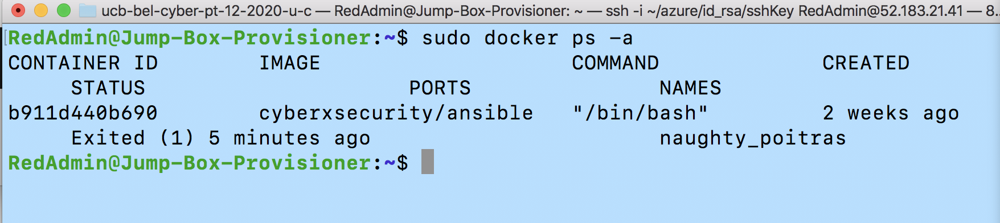

# Automated-ELK-Stack-Deployment

# Table of Contents
- [Network Diagram](#Network-Diagram)
- [Description of the Topology](#Description-of-the-Topology)
- Basics
  - [ELK Stack](#What-is-an-ELK-stack)
  - [Ansible](#What-is-Ansible)
- [Server Requirements](#Minimum-Server-Requirements)
- [Infrastructure Access Policies](#Access-Policies)
- [Setup Instructions](#Setup Instructions)
- [ELK Config File](/Files/install-elk.yml)
- [Filebeat Config File](/Files/filebeat-config.yml)
- [Metricbeat Config File](/Files/metricbeat-config.yml)
- Setting up your Ansible environment  and SSH Keys
- [Deploying the ELK Stack using Ansible](#Elk-Configuration)
- [Deploying the Filebeat clients using Ansible](#Filebeat)
- [Deploying the Metricbeat clients using Ansible](#Metricbeat)
- Check on all services are up and running
- Exploring Kibana


*The files in this repository were used to configure the network depicted below.

## Network Diagram


These files have been tested and used to generate a live ELK deployment on Azure. They can be used to either recreate the entire deployment pictured above. Alternatively, select portions of the Ansible-Playbook elk.yml file may be used to install only certain pieces of it, such as Filebeat.

- [ELK Config ](/Files/install-elk.yml)
- [Elk Playbook](/Files/install-elk.yml)
- [Filebeat Config ](/Files/filebeat-config.yml)
- [Filebeat Playbook](/Files/filebeat-playbook.yml)
- [Filebeat Config ](/Files/metricbeat-config.yml)
- [Metricbeat Playbook](/Files/metricbeat-playbook.yml)

## Description of the Topology

The main components of the above newtork topology are:

1. A load balanced (DVWA) Damn Vulnerable Web Application servers
2. ELK (ElasticSearch, LogStash Kibana) server to monitor the web application.
3. A jumpbox server through which authorized users are given access to protected web servers

DVWA is mirrored on three web servers for the purpose of load balancing the web traffic. The traffic to this web application is efficiently distributed among the three web servers, by the load balancer.

Load balancer also ensures high avaiablitity and reliability by directing the traffic only to the servers that are online. The off loading function of the load balancer helps organizations from Distributed Denial of Service (DDoS) attacks.

A jumpbox server is a linux based VM server with restricted access from internet. Jumpbox is used as the only gateway to our infrastructure. The purpose of the Jumpbox is only to provide access to the web servers and does not provide any public services. Jumpbox provides security through obscurity.

*Integrating an ELK server allows users to easily monitor the vulnerable VMs for changes to the file system and system metrics.

What does Filebeat watch for?
It monitors the log files/locations that you specify and forwards them to Elasticsearch/Logstash for indexing.

What does Metricbeat record?
It records metrics/statistics data and transports them to the output that you specifics thru Elasticsearch/Logstash.

*The configuration details of each machine may be found below. Note: Use the Markdown Table Generator to add/remove values from the table.

| Name                | Function   | IP Address    | Operating System |
|---------------------|------------|---------------|------------------|
| JumpBox Provisioner | Gateway    | 10.0.0.4      | Linux            |
| Web-1               | Web Server | 10.0.0.5      | Linux            |
| Web-2               | Web Server | 10.0.0.6      | Linux            |
| Web-3               | Web Server | 10.0.0.9      | Linux            |
| ELK-Server          | Monitoring | 10.1.0.4      | Linux            |

## What is an ELK stack?

ELK stands for Elasticsearch, Logstash and Kibana. It is a collection of three open source products (Elasticsearch, Logstash and Kibana). ELK is a centralized logging platform to perform functions such as statistical analysis, queries over a large set of log data efficiently.

Elasticsearch — Search engine that makes the queries possible. Input to ES has to be in JSON format.
Logstash — Filter engine that processes the logs format before being indexed by Elasticsearch
Kibana — GUI interface

## What is Ansible?

It is a Infrastructure as a code tool. Scripts in the form yaml files are used to perform configuration management against remote servers, with idempotent execution and users can easily scale those scripts to hundreds of servers, without having to access each remote server.

Playbooks — Ansible scripts in the form of yaml files.


## Minimum Server Requirements

ELK → 2 VCPUs, 8GB RAM

## Access Policies

The machines on the internal network are not exposed to the public Internet.

Only the JumpBox Provisioner machine can accept connections from the Internet. Access to this machine is only allowed from the my personal public IP addresses
- Personal Laptop Public IP

Machines within the network can only be accessed by peer servers and a connection via JumpBox. The Jumpbox Provisioner connects via SSH to the Webservers (Web 1, Web 2 & Web 3) and the ELK Server. The Web Server machines send logs to the ELK Server to be forwarded for indexing. JumpBox Provisioner's public IP address - 52.183.21.41

A summary of the access policies in place can be found in the table below.

| Name                | Publicly Accesible  | Allowed IPs   |
|---------------------|---------------------|---------------|
| JumpBox Provisioner | Yes                 | Personal Laptop Public IP   |
| Web-1               | No                  | 10.0.0.4  |
| Web-2               | No                  | 10.0.0.4  |
| Web-3               | No                  | 10.0.0.4  |
| ELK-Server          | No                  | 10.0.0.4 |

--All these VMs can only be accessed form the Jump-Box-Provisioner--

## Setup Instructions

In the Azure portal, a cloud network consisting of :
- A Jumpbox server, 
- Three web application servers and 
- A load balancer 
All these components are configured within a resource group called *Red Team Resource group*. Please refer the network diagram below for the Red Team cloud network architechure.


### Steps to configure an ELK server within an existing virtual network.

- [Create a new vNet in a new region, within the existing Red Team resource group.](/Files/Vnet.md)
- [Create a Peer Network Connection between the two vNets.](/Files/Peer-Vnet.md)
- [Create a new VM. Deploy a new VM into the new vNet with it's own Security Group. This VM will host the ELK server.](/Files/ELK-VM.md)
- [Download and configure a container. Download and configure the elk-docker container onto this new VM.](/Files/ELK-container.md)
- [Launch and expose the container. Launch the elk-docker container to start the ELK server.](/Files/Launching-container.md)
- [Implement identity and access management. Configure your new Security group so you can connect to ELK via HTTP, and view it through the browser.](/Files/Access-Management.md)
- [Filebeat Installation](/Files/Filebeat-install.md)
- [Metricbeat Installation](/Files/Metricbeat-install.md)

### Elk Configuration

*Ansible was used to automate configuration of the ELK machine. No configuration was performed manually, which is advantageous because it automates IT configuration management, and deployment to multiple servers at the same time. Also, Ansible has a portal called Ansible Galaxy, central repository for locating, reusing, and sharing Ansible-related content.

*The playbook implements the following tasks:

[Elk Playbook](/Files/install-elk.yml)

install-elk.yml consists of two sections
1. Host Declaration -  Here we list the server groups(defined in /etc/ansible/hosts file) on which the playbook will run.
2. Action/ Task Declaration -   List out the task to be executed. Each task is given a name in the playbook

The playbook implements the following tasks on the ELK server:
1. Install docker.io
2. Install pip3
3. Install Docker python module
4. Increase the max_map_count kernel parameter to avoid running out of map areas for the Vector Server process
5. Download and launch a docker elk container
6. Enable service docker on boot

*The following screenshot displays the result of running docker ps after successfully configuring the ELK instance.



Target Machines & Beats

*This ELK server is configured to monitor the following machines:

List the IP addresses of the machines you are monitoring
- Web-1 (10.0.0.5)
- Web-2 (10.0.0.6)
- Web-3 (10.0.0.9)

We have installed the following Beats on these machines:
- Filebeat
- Metricbeat

*These Beats allow us to collect the following information from each machine:

Filebeat monitors the log files or locations that you specify, collects log events, and forwards them either to Elasticsearch or Logstash for indexing

The filebeat-configuration.yml is configured to fetch all the log files in this path (/var/log/*.log) from the web servers (10.0.0.5, 10.0.0.6, 10.0.0.9).

Metricbeat collects machine metrics. it is simply a measurement to tell analysts how healthy it is.Examples of Metricbeat  data can be CPU usage/Uptime

### Using the Playbook

- [Filebeat Playbook](/Files/filebeat-playbook.yml)
- [Metricbeat Playbook](/Files/metricbeat-playbook.yml)

*In order to use the playbook, you will need to have an Ansible control node already configured. Assuming you have such a control node provisioned:

SSH into the control node and follow the steps below:

---Filebeat---

1. Replace The IP address with the ELK server private IP address in the filebeat-configuration.yml and save the file to /etc/ansible/files/filebeat-config.yml.
2. Update the /etc/ansible/hosts file to include the IP addresses of webservers on which the filebeat is installed.
3. Run the playbook, and navigate to http://20.80.232.219:5601/app/kibana to check that the installation worked as expected.

---Metricbeat---

1. Replace The IP address with the ELK server private IP address in the metric-configuration.yml and save the file to /etc/ansible/files/metric-config.yml.
2. Update the /etc/ansible/hosts file to include the IP addresses of webservers on which the filebeat is installed.
3. Run the playbook, and navigate to http://20.80.232.219:5601/app/kibana to check that the installation worked as expected.

Answer the following questions to fill in the blanks:

- Which file is the playbook?
  - filebeat-playbook.yml
- Where do you copy it?
   - /etc/ansible/files
- Which file do you update to make Ansible run the playbook on a specific machine?
   - /etc/ansible/hosts file (IP of the Virtual Machines).
- How do I specify which machine to install the ELK server on versus which to install Filebeat on?
  - Host Inventories are created in the /etc/ansible/hosts file. The host file consists of host groups and hosts within those groups. All the webservers IP addresses are under 'webservers' group and ELK server is put under the 'elk-server' group. In the filebeat yml playbook  file, host name is configured as webservers (to install only on 3 web servers) and in the elk-install  yml playbook file, the host name is configured as elk-server.
  
- Which URL do you navigate to in order to check that the ELK server is running?
   - http://20.80.232.219:5601/app/kibana

As a Bonus, provide the specific commands the user will need to run to download the playbook, update the files, etc.

### Filebeat
```
1. cd /etc/ansible
2. curl https://gist.githubusercontent.com/slape/5cc350109583af6cbe577bbcc0710c93/raw/eca603b72586f be148c11f9c87bf96a63cb25760/Filebeat > filebeat-config.yml
3. nano filebeat-config.yml
```
Edit the config file to replace the ELK server IP address at lines #1106 and #1806.

```bash
output.elasticsearch:
hosts: ["10.1.0.4:9200"]
username: "elastic"
password: "changeme"
```
```
setup.kibana:
host: "10.1.0.4:5601"
```
Save this file in  `/etc/ansible/files/filebeat-config.yml`


Create the playbook: nano filebeat-playbook.yml

```
---
- name: Installing and Launch Filebeat
hosts: webservers
become: yes
tasks:
# Use command module
- name: Download filebeat .deb file
command: curl -L -O https://artifacts.elastic.co/downloads/beats/filebeat/filebeat-7.4.0-amd64.deb

# Use command module
- name: Install filebeat .deb
command: dpkg -i filebeat-7.4.0-amd64.deb

# Use copy module
- name: Drop in filebeat.yml
copy:
src: /etc/ansible/files/filebeat-config.yml
dest: /etc/filebeat/filebeat.yml

# Use command module
- name: Enable and Configure System Module
command: filebeat modules enable system

# Use command module
- name: Setup filebeat
command: filebeat setup

# Use command module
- name: Start filebeat service
command: service filebeat start

# Use systemd module
- name: Enable service filebeat on boot
systemd:
name: filebeat
enabled: yes

```

To run the playbook: ansible-playbook filebeat-playbook.yml

```bash

cd /etc/ansible/files
ansible-playbook filebeat-playbook.yml

```


### Metricbeat
```
1. cd /etc/ansible
2. curl https://gist.githubusercontent.com/slape/58541585cc1886d2e26cd8be557ce04c/raw/0ce2c7e744c54513616966affb5e9d96f5e12f73/metricbeat > metricbeat-config.yml
3. nano metric-config.yml
```
Edit the config file to replace the ELK server IP address at lines #62 and #95.

```
setup.kibana:
host: "10.1.0.4:5601"
```
```
output.elasticsearch:
# Array of hosts to connect to.
hosts: ["10.1.0.4:9200"]
username: "elastic"
password: "changeme"
```

Create the playbook: nano metricbeat-playbook.yml

To run the playbook: ansible-playbook metricbeat-playbook.yml

```
cd /etc/ansible/files
ansible-playbook metricbeat-playbook.yml
```
